=============
Job positions
=============

In the default *Recruitment* dashboard view, all job positions are shown, regardless of status.
Current published positions with active applicants are shown, as well as job positions that have
been created but have not yet been published.

Each position is shown in an individual Kanban card. If the job position is active and candidates
can apply, a *Published* banner will appear in the top right corner of the card. Any applications
will be listed in an :guilabel:`X Applications` button, with X being the number of applications
received. If the position is not published, a :guilabel:`Start Recruitment` button will appear
instead.

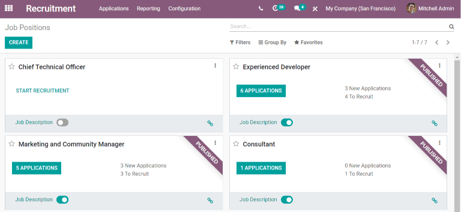

Create a new job position
=========================

There are two ways a job position can be created, from the main *Recruitment* dashboard view, or
from the configurations menu. To create a job position from the configurations menu, go to
:menuselection:`Recruitment app  --> Configuration  --> Job Positions`. The job positions in this
view are displayed in a list.

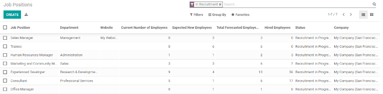

To create a new job position from either the main recruitment dashboard or the configurations menu,
click the :guilabel:`Create` button in the top left.

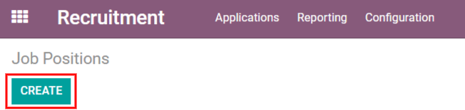

A pop-up will appear. Enter the name of the position, such as Sales Manager, Mechanical Engineer,
etc. When entered, click the :guilabel:`Create` button to save it, or the :guilabel:`Discard` button
to delete the entry.

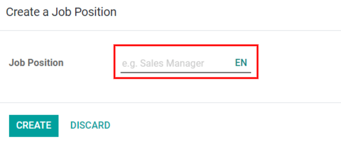

Once the job position has been created, it will appear as a card in the Kanban view in the main
*Recruitment* dashboard, and in the list view in the configuration dashboard.

Edit a new job position
-----------------------

Once the job position is created, it's time to enter the details for the position. Click on the
three dots in the upper right corner of the card to reveal several options, then click
:guilabel:`Edit` to edit the details.

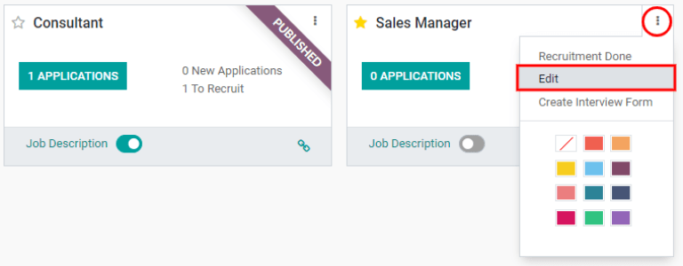

Enter the job description in the *Job Description* tab. This information is what is visible to
potential employees when searching for available jobs.

Recruitment
~~~~~~~~~~~

All the basic information about the job position is listed under the *Recruitment* tab. None of
the fields are required, but it is a good idea to fill in the information pertaining to the specific
job, such as where the job is located.

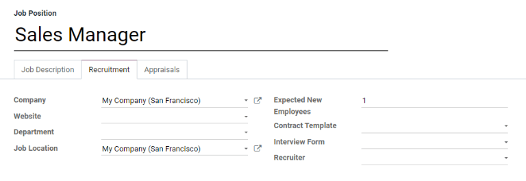

- :guilabel:`Company`: Select the company the job is for.
- :guilabel:`Website`: Select the website the job will be published.
- :guilabel:`Department`: Select the relevant department for the job position.
- :guilabel:`Expected New Employees`: Enter the number of employees to be hired for this position.
- :guilabel:`Contract Template`: Select a contract template that will be used when offering the job
  to the candidate.
- :guilabel:`Interview Form`: Select a form that applicants will fill out prior to their interview,
  or create a new form. Once selected, a :guilabel:`Display (Name) Form` will appear next to the
  selected form. Click on this to see how the form will be displayed to the candidate on the front
  end.

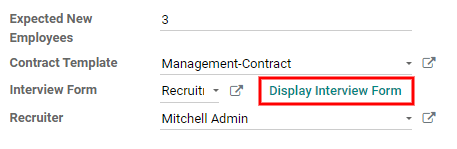

- :guilabel:`Recruiter`: Select the person who will be doing the recruiting for this role.

.. note::
   All the fields in the recruitment section, except for :guilabel:`Expected New Employees`, use a
   drop-down menu to make the selection.

Appraisals
~~~~~~~~~~

This tab displays both the Employee Feedback Template and the Manager Feedback Template which will
be used after the employee has been hired and the predetermined time has passed and feedback is
requested.

Create interview form
---------------------

Once a job position has been made, the *Interview Form* needs to be created. Click on the three dots
in the upper right corner of the card to reveal several options, then click
:guilabel:`Create Interview Form` to edit the interview form.

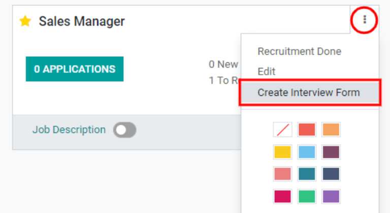

Click on :guilabel:`Add a section` to add a section to the form. A line will appear and the section
can be entered.

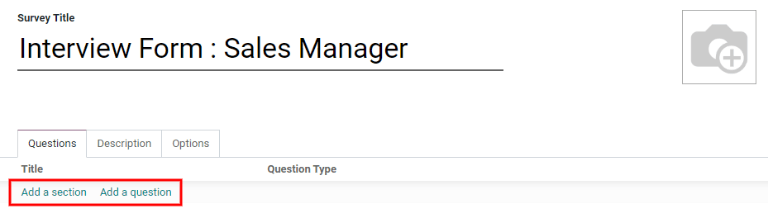

Click off the line, or press enter to create the new section.

Click :guilabel:`Add a question` to add a question to the section. A pop-up window appears to enter
the question details. Type out the question in the top line.

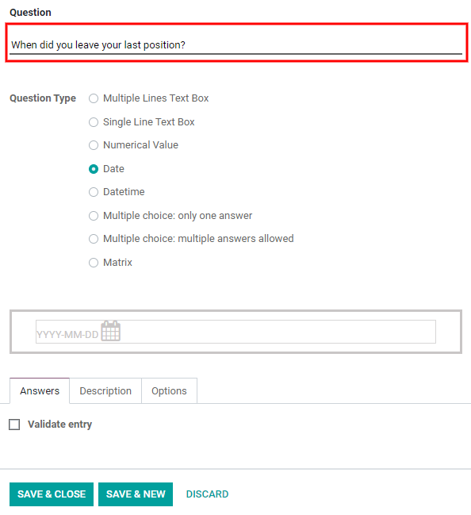

There are several *Question Types* to choose from:

- :guilabel:`Multiple Lines Text Box`: Allows the applicant to enter several lines of text.
- :guilabel:`Single Line Text Box`: Limits the applicant to only a single line of text.
- :guilabel:`Numerical Value`: Only allows a number to be entered.
- :guilabel:`Date`: A calendar module is presented to select a date.
- :guilabel:`Datetime`:  A calendar module and a clock icon is presented to select a date and time.
- :guilabel:`Multiple choice: only one answer`: Allows for only one answer to a multiple-choice
  question.
- :guilabel:`Multiple choice: multiple answers allowed`: Allows many answers to a multiple-choice
  question.
- :guilabel:`Matrix`: Allows for a customizable table to be presented for the candidate to choose an
  answer for each row.

Questions and sections can be reorganized. Click and drag individual sections or questions to the
desired position to move them.

Sections are indicated by a gray background, questions have a white background.

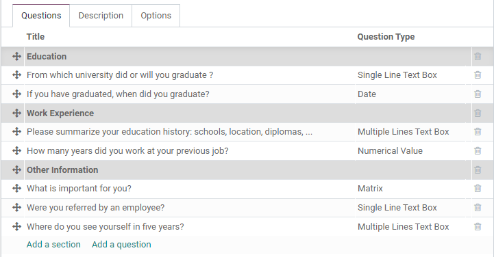

Next, configure the options for the interview form. Click the :guilabel:`Options` tab to view all
the options to configure, by category.

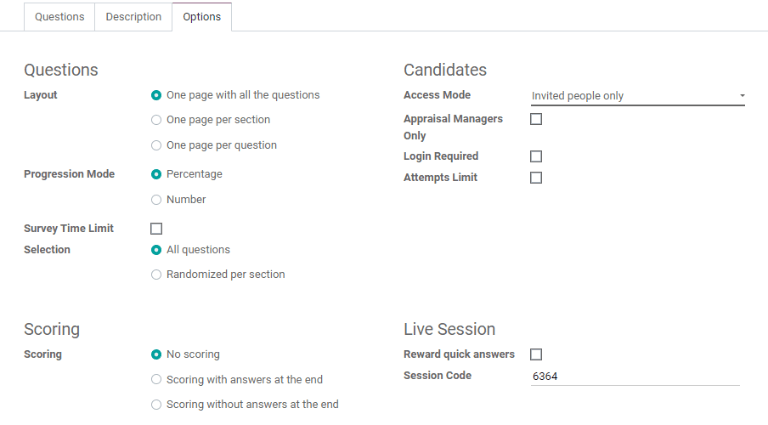

Questions
~~~~~~~~~

- :guilabel:`Layout`: Choose how the questions should be displayed.

  - *One page with all the questions*: Display all sections and questions at the same time.
  - *One page per section*: Display each section with the corresponding questions on an individual
    page.
  - *One page per question*: Display a single question on each page.

- :guilabel:`Progression Mode`: Chose to either display the progress the candidate is making with
  the form either as a percent (*percentage*), or as a number (*number*).
- :guilabel:`Survey Time Limit`: Check this box to limit the time allowed to complete the form. When
  selected, a field to enter the minutes appears next to the checked box. Enter the time (in a XX:XX
  minute format) in the field.
- :guilabel:`Selection`: Chose to either display the entire form (*all questions*), or only a random
  selection of questions from each section (*randomized per section*). The latter is not typically
  selected for an interview form.

Scoring
~~~~~~~

- :guilabel:`No scoring`: Click this option to not score the form.
- :guilabel:`Scoring with answers at the end`: Click this option to score the form and display
  the correct answers for the candidate when they are finished with the form.
- :guilabel:`Scoring without answers at the end`: Click this option to score the form but not
  display the answers at the end.

If one of the scoring options was selected, a *Success %* field appears. Enter the percentage the
candidate needs to pass the exam (example, 80.00%). The entry should be written in an “XX.XX”
format.

.. example::
   A software company, *Awesome Data*, is looking for new coders to hire. Since the skill set they
   need is very specific, an easy way to filter applicants is to give them a coding test. Scoring
   for a coding test is a perfect solution for *Awesome Data*, so they made a test with a required
   80% success rate. This has greatly helped their HR department save a lot of time finding the
   right people!

Candidates
~~~~~~~~~~

- :guilabel:`Access Mode`: Select from the drop-down menu if anyone can access the exam if they have
  the link (*anyone with the link*), or if only candidates specifically invited to take the exam can
  access the exam (*invited people only*).
- :guilabel:`Appraisal Managers Only`: Check this box so only the managers who are reviewing the
  exam can see the answers. If left unchecked, anyone can view the results.
- :guilabel:`Login Required`: Check this box to require candidates to log in before taking the exam,
  whether they have a valid token or not.
- :guilabel:`Attempts Limit`:  If the exam should only be taken a specific number of times, check
  this box, then enter the maximum attempt number in the field next to it.

Live Session
~~~~~~~~~~~~

- :guilabel:`Reward quick answers`: If the exam is to be taken live, check this box to award more
  points to participants who answer quickly.
- :guilabel:`Session Code`: Enter a code for participants to enter, to allow them into the
  live exam session.

After all fields have been entered, click the :guilabel:`Save` button to save the changes, or click
:guilabel:`Discard` to delete the changes.
